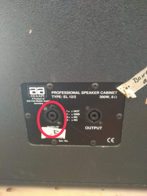

# Anleitung Musikanlage SV Stammham
(große Turnhalle)

## Aufbau

### Generell

Klappe hinten öffnen und Stecker in die Steckdose stecken

### Box anschließen

Graues Kabel mit blauem Stecker auf der Hinterseite der Box
	in den **INPUT** Steckplatz stecken

## Einschalten

1. Schauen ob Verstärker eingeschaltet ist. Er ist ganz unten mit der Beschriftung *V3000*. Es sollte die grüne Lampe
leuchten.
	a. Lampe leuchtet --> Prima
	b. Lampe leuchtet nicht --> über Kippschalter (0/1) unter Beschriftung *V3000* einschalten
2. 	Überprüfen, ob der CD-Spieler eingeschaltet ist, man erkennt es an den leuchtenden CD-Bedienungsknöpfen
	a. ja, super
	b. nein --> *Power* Knopf vorne zwischen den CD-Einschüben betätigen
3. Überprüfen, ob der Mischpult eingeschaltet ist, man erkennt es an der blauen Lampe an der Oberseite. Diese befindet 
sich bei der Draufsicht, rechts oben, direkt unter dem schwarzen (AN/AUS) Knopf 
	a. ja, sie leuchtet --> jeah
	b. nein --> schwarzen *Power* Knopf daneben drücken
	
Glückwunsch, die Anlage ist nun betriebsbereit.

## Musik abspielen

### Quelle auswählen

Es gibt bei der Anlage zwei Quellen für Musik. Beide können jeweils von CD, USB-Stick oder SD-Karte Musik abspielen. Die
Umschaltung erfolgt auf der Oberseite der Anlage.

### Lautstärke und Sound einstellen

Es gibt bei der Anlage 4 Kanäle plus Mikro. Zusätzlich gibt es einen zentralen Einstellungsbereich, welcher dann für alle Kanäle und
das Mikro gilt. Im folgenden werden alle Einstellmöglichkeiten erklärt.

Die Knöpfe sind wie im Bild dargestellt folgendermaßen belegt.

Von links nach rechts genannt:

1. (rot) Mikrofon
2. (grün) linker CD-Spieler
3. (blau) rechter CD-Spieler
4. (gelb) nicht belegt --> egal
5. (orange) zentrale Einstellungen, welche für alles gelten

Pro Einstellungsfeld hat man folgende Einstellmöglichkeiten für den Klang:

1. **GAIN** die Verstärkung der Quelle --> höher drehen macht die Quelle lauter
2. **TREBLE** die Höhen manipulieren
3. **MID** den mittleren Klangbereich manipulieren
4. **BASS** den Bass manipulieren

*TIP: Es ist meist sinnvoll die Regler auf einer mittleren Einstellung zu belassen, auch wenn die Punkte
etwas anderes suggerieren*
	
Darunter befinden sich Kippschalter. Diese sollten auf folgenden Einstellungen belassen werden:

1. Kippschalter mit **Phono x / AUX x** oder **LINE x** x ist die Kanalnummer bleibt bei Kanälen 1 und 2
immer auf **LINE 2** bzw. **LINE 2**
2. Kippschalter *TALKOVER* beim Mikrofon sollte auf **OFF** stehen. **ON** bewirkt, dass die Sprache über die 
Musik gelegt wird. Das klappt nur bei richtigen Lautstärkeeinstellungen. **OFF** bedeutet, dass die Musik für die
Sprechdauer leise gestellt wird.
	

Unter den Kippschaltern befinden sich die Lautstärkeregler für jeden einzelnen Kanal. Hochschieben = lauter und runter 
entsprechend leiser. Etwas rechts befindet sich der zentrale Schieberegler **M** = Master. Er regelt die Lautstärke für 
alle.

*TIP: Alle Lautstärkeregler sollten ebenfalls auf einer mittleren Position stehen. Von dort aus können Anpassungen einfach 
gemacht werden.*

### Fader

Die Anlage verfügt über einen so genannten *Fader*. Es ist der Regler über der Beschriftung **FADER "Q" START**. 

Das bedeutet, dass gleichzeitig Musik von CD-Spieler 1 und CD-Spieler 2 abgespielt werden kann und auch aus den Boxen kommt :-D. 
Über den Schieberegler kann man die Intensität von nur CD-Spieler 1 (links) auf nur CD-Spieler 2 (rechts) stufenlos verschieben. 
In der Mitte werden beide Quellen gleich laut eingespielt.

Er ist eine beliebte Fehlerquelle. Steht er z.B. rechts, könnt ihr aus dem linken CD-Spieler keine Musik
abspielen. Egal, wie die Lautstärkeregler eingestellt sind.

*TIP: Der Fader ist tricky, bei Unsicherheit am besten in der Mittelstellung belassen, dann jedoch nicht beide CD-Spieler gleichzeitig nutzen!*

Die Drehschalter links und rechts neben dem Fader sind die Kanalquellen. Diese sollten so belassen werden und sind links auf Kanal 1, sowie 
rechts auf Kanal 2 gestellt.

